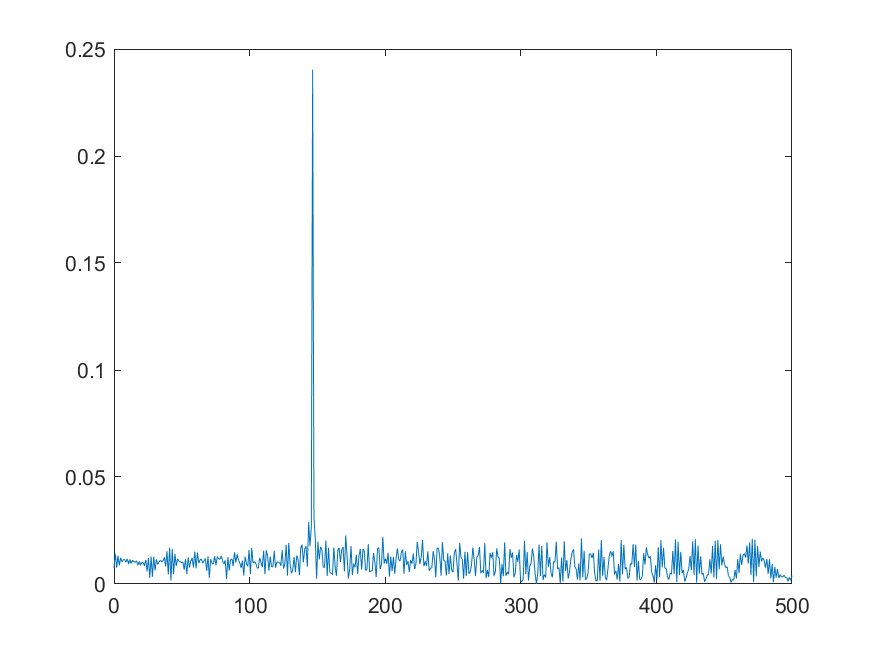
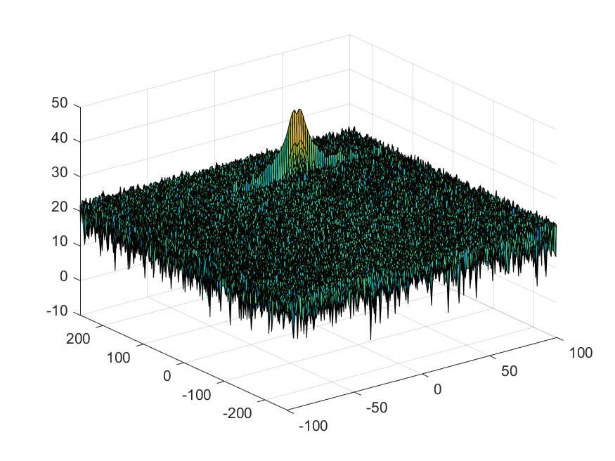
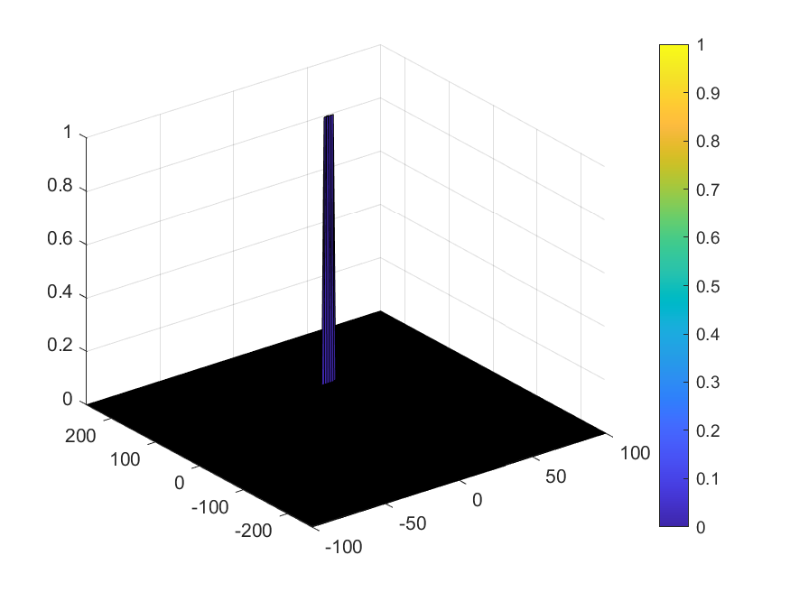

# SFND_Radar_Target_Generation_and_Detection

Implementation steps for the 2D CFAR process;
- Calculate Bandwidth (B), Chirp Time (Tchirp) and Slope (slope) of the FMCW,
- Transmitted, receive and beat signal generation,
- Reshape beat signal, calculating FFT of it and normalization,
- Select guard and training cell sizes,
- Calculate noise level and update RDM according to determined threshold,
- Supress non-thresholded cells.

Selection of Training, Guard cells and offset;
- Calibrate training and guard cell sizes using various performance tests.
- Select offset from the data.

Steps taken to suppress the non-thresholded cells at the edges;
- RDM has been looped and elements has value rather then 0 or 1 have been suppressed to 0. Because thresholded RDM elements has value either 1 or 0.